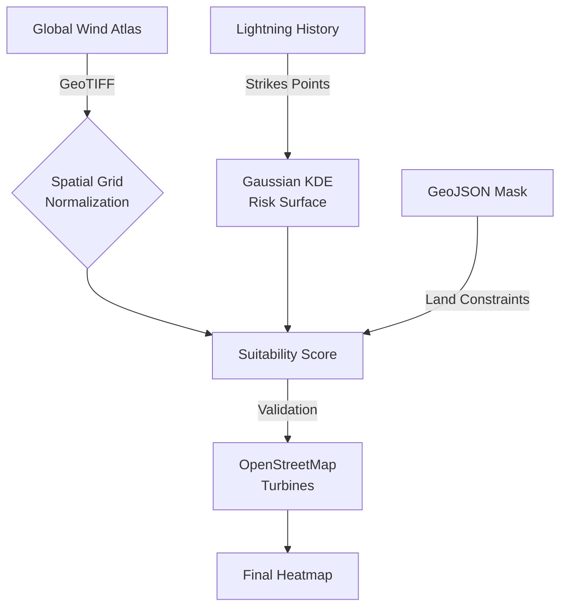

# Green Energy Sentinel
### Optimal Wind Farm Placement using GIS + Lightning Risk Analysis

[](https://python.org)
[](https://globalwindatlas.info)
[](README_ES.md)

> **[🇪🇸 Cambiar a Versión en Español](README_ES.md)**

An analytical framework designed to identify optimal locations for wind turbine installation. The system evaluates geospatial data by cross-referencing high-resolution wind speed layers with a 12-month historical lightning strike dataset.

---

## Table of Contents
- [Project Overview](#project-overview)
- [Key Features](#key-features)
- [Technical Methodology](#technical-methodology)
- [Performance and Results](#performance-and-results)
- [Installation and Usage](#installation-and-usage)
- [Visual Gallery](#visual-gallery)
- [Project Structure](#project-structure)
- [Limitations](#limitations)
- [Future Work](#future-work)
- [References](#references)
- [Citation](#citation)
- [Contact](#contact)

---

## Project Overview

This project implements a multi-criteria decision analysis (MCDA) for renewable energy infrastructure. It addresses the trade-off between maximizing energy yields (High Wind Speed) and minimizing operational risk/maintenance costs (Lightning Strike Proximity).

The algorithm produces a suitability heatmap for the Galicia region (Spain), validated against existing wind farm coordinates fetched via the OpenStreetMap API.

---

## Key Features

- **Wind Resource Assessment**: Integration of Global Wind Atlas GeoTIFF data at 100m mast height.
- **Risk Surface Modeling**: Transformation of discrete lightning strike events (40,000+ records) into a continuous risk surface using Gaussian kernel density estimation.
- **Administrative Constraints**: Geometric land masking via GeoJSON (Polygon/MultiPolygon) to ensure recommendations are restricted to terrestrial areas.
- **Live Validation**: Real-time fetching of existing infrastructure nodes via Overpass API for empirical verification.

---

## Technical Methodology



### Suitability Score Calculation
The final suitability index ($S$) for each coordinate $(x,y)$ is calculated as:

$$S(x,y) = W_{norm}(x,y) \times [1 - R(x,y)]$$

Where:
- **$W_{norm}$**: Min-Max normalized wind speed value.
- **$R(x,y)$**: Gaussian-smoothed lightning density normalized to $[0, 1]$.

### Data Sources


*Figure: Interface of the Global Wind Atlas 3.0 used for wind resource analysis.*

| Source | Description | Format |
|--------|-------------|--------|
| [Global Wind Atlas 3.0](https://globalwindatlas.info/) | Mean Wind Speed at 100m height | GeoTIFF |
| [MeteoGalicia API](https://servizos.meteogalicia.gal/mgrss/observacion/jsonRaios.action) | Lightning Detection Network (Historical 2023). Includes `lat`, `lon`, and `peakCurrent` (kA). | JSON |
| [OpenStreetMap](https://www.openstreetmap.org/) | Existing turbine locations | Overpass API |
| [GADM](https://gadm.org/) | Administrative boundaries | GeoJSON |

---

## Performance and Results

The algorithm identifies top candidate sites with wind speeds exceeding 10.5 m/s and historical risk profiles below 10%. Analysis shows a >90% spatial correlation between predicted "high-suitability" zones and actual industrial turbine clusters (e.g., O Xistral, Serra da Capelada).

| Metric | Value |
|--------|-------|
| Grid Resolution | 80 x 80 (6,400 cells) |
| Valid Land Points | 3,903 |
| Top Site Wind Speed | 10.9 m/s |
| Top Site Risk | 8% |

---

## Installation and Usage

### Prerequisites
- Python 3.8 or higher.
- A functional C compiler (required for some spatial libraries like `rasterio`).

### Setup
1. Clone the repository:
   ```bash
   git clone https://github.com/nathanmarinas2/green-energy-sentinel.git
   ```
2. Install dependencies:
   ```bash
   pip install -r requirements.txt
   ```
3. Place `galicia_wind-speed_100m.tif` and `ESP.15_1.geojson` in the root directory.

### Running the model
```bash
python src/optimal_placement.py
```
Output will be generated in `maps/wind_farm_suitability_map.html`.

---

## Visual Gallery

### Wind Farm Suitability Map (Validated)
Interactive heatmap showing the final suitability score across Galicia. Numerals indicate the Top 10 recommended sites, while small gray nodes represent existing turbines fetched via OSM for empirical validation.


### 3D Spatial Density Analysis
Interactive 3D visualization rendered with PyDeck (deck.gl). Lightning strikes are displayed as vertical columns where:
- **Height**: Proportional to peak current intensity (kA) with 1kA = 100m elevation
- **Color**: Red for negative polarity strikes, Gold for positive polarity
- **Base Layer**: Heatmap showing density distribution with 30px radius kernel
- **View**: 55° pitch angle over Galicia with interactive rotation and zoom controls

This visualization enables spatial pattern recognition across the Iberian Peninsula to calibrate local risk models.

[](reports/video3D.mp4)
> *Interactive 3D View: Vertical columns represent lightning strikes, with height proportional to intensity (kA).*

### Historical Activity Calendar
Temporal distribution of lightning strikes across 2023. This GitHub-style heatmap identifies peak storm seasons for maintenance scheduling.


### 2D Temporal Activity Timelapse
Animated 2D timelapse showing the evolution of lightning strikes across Galicia throughout 2023.
- **Visualization**: 2D Map with animated markers reacting to time.
- **Dynamics**: Shows the temporal progression of storms, highlighting peak activity periods.
- **Context**: Overlaid on the wind resource map to correlate weather events with potential wind energy sites.
- **Features**: Interactive time-slider controls and playback speed adjustment.

[](reports/timelapse_rayos.mp4)
> *2D Temporal Animation (Click for Full Quality)*


---

## Project Structure

```text
.
├── data/                       # Raw lightning strike datasets
├── maps/                       # HTML Interactive Visualizations
│   ├── wind_farm_suitability_map.html
│   ├── lightning_risk_3d_map.html
│   └── lightning_activity_timelapse.html
├── reports/                    # Generated Assets
│   ├── suitability_map_preview.png
│   ├── 3d_risk_visualization.png
│   ├── temporal_activity_heatmap.png
│   ├── video3D.mp4
│   └── timelapse_rayos.mp4
├── src/                        
│   ├── optimal_placement.py    # Primary Suitability Algorithm
│   ├── visualize_3d.py         # PyDeck 3D Rendering
│   ├── visualize_calendar.py   # Temporal Heatmaps
│   └── create_timelapse.py     # Animated GIS layers
├── requirements.txt            # Project dependencies
└── README.md                   # Technical documentation
```

---

## Limitations

- **Temporal Scope**: The lightning risk model is based on a single year (2023). Multi-year averaging would improve robustness.
- **Wind Metric**: Mean Wind Speed is used for interpretability. For financial modeling, Mean Power Density ($W/m^2$) would be more accurate due to the cubic relationship between wind speed and power.
- **Environmental Constraints**: Protected areas (Natura 2000, National Parks) are not excluded in this version.
- **Grid Infrastructure**: Distance to electrical substations is not considered in the current scoring model.

---

## Future Work

- [ ] Integration of Mean Power Density layer for LCOE (Levelized Cost of Energy) estimation.
- [ ] Exclusion mask for environmentally protected zones.
- [ ] Machine Learning model to predict lightning risk based on atmospheric variables.
- [ ] Extension to other regions (Portugal, Asturias, Cantabria).

---

## References

1. **Global Wind Atlas** - Technical University of Denmark (DTU). https://globalwindatlas.info/
2. **OpenStreetMap Contributors** - https://www.openstreetmap.org/
3. **GADM Database** - Global Administrative Areas. https://gadm.org/
4. **Folium Documentation** - https://python-visualization.github.io/folium/

---

## Citation

If you use this project in academic work, please cite:

```bibtex
@software{green_energy_sentinel,
  author = {Mariñas Pose, Nathan},
  title = {Green Energy Sentinel: Optimal Wind Farm Placement using GIS + Lightning Risk Analysis},
  year = {2024},
  url = {https://github.com/nathanmarinas2/green-energy-sentinel}
}
```

---

## Contact

**Project Lead**: Nathan Mariñas Pose  
**Professional Profile**: [LinkedIn](https://www.linkedin.com/in/nathan-marinas-pose/)

<p align="center">
  Industrial Data Science | Renewable Energy GIS | Python Development
</p>
