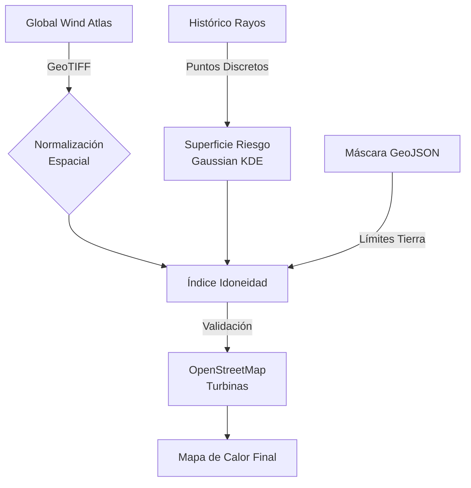
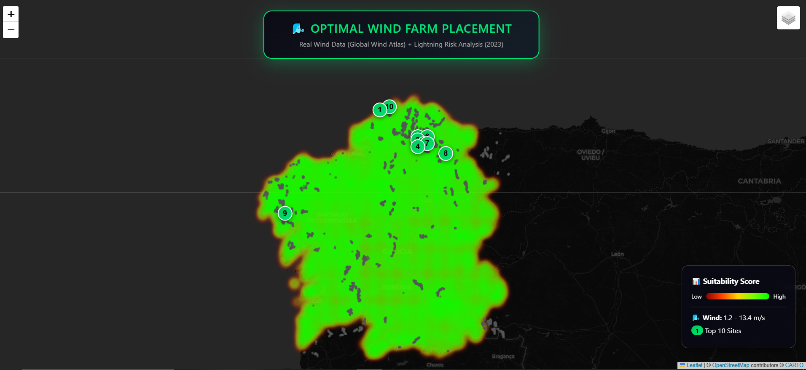

# Green Energy Sentinel
### Ubicación Óptima de Parques Eólicos mediante GIS + Análisis de Riesgo de Rayos

[](https://python.org)
[](https://globalwindatlas.info)
[](README_ES.md)

> **[🇺🇸 switch to English Version](README.md)**

Un sistema inteligente diseñado para identificar la **ubicación óptima** para la instalación de aerogeneradores. El algoritmo evalúa datos geoespaciales cruzando mapas de viento de alta resolución con un registro histórico de rayos (periodo 2023) para maximizar la producción y minimizar riesgos.

---

## Tabla de Contenidos
- [Descripción del Proyecto](#descripción-del-proyecto)
- [Características Clave](#características-clave)
- [Metodología Técnica](#metodología-técnica)
- [Rendimiento y Resultados](#rendimiento-y-resultados)
- [Instalación y Uso](#instalación-y-uso)
- [Galería Visual](#galería-visual)
- [Estructura del Proyecto](#estructura-del-proyecto)
- [Limitaciones](#limitaciones)
- [Trabajo Futuro](#trabajo-futuro)
- [Referencias](#referencias)
- [Contacto](#contacto)

---

## Descripción del Proyecto

Este proyecto implementa un Análisis de Decisión Multicriterio (MCDA) para infraestructura de energía renovable. Aborda el equilibrio entre **maximizar la producción de energía** (Alta velocidad del viento) y **minimizar el riesgo operativo** (Proximidad histórica de rayos).

El algoritmo genera un mapa de calor de idoneidad para la región de Galicia (España), validado empíricamente contra las coordenadas reales de parques eólicos existentes (obtenidas vía OpenStreetMap).

---

## Características Clave

- **Evaluación del Recurso Eólico**: Integración de datos GeoTIFF del Global Wind Atlas a 100m de altura.
- **Modelado de Superficie de Riesgo**: Transformación de eventos discretos de rayos (+40.000 registros) en una superficie de riesgo continua mediante estimación de densidad de kernel gaussiano.
- **Restricciones Administrativas**: Enmascaramiento geométrico terrestre mediante GeoJSON (Polígono/MultiPolígono) para asegurar que las recomendaciones se limitan a tierra firme.
- **Validación en Tiempo Real**: Descarga automática de nodos de infraestructura existentes vía Overpass API para verificación empírica.

---

## Metodología Técnica



### Cálculo del Índice de Idoneidad
El índice final de idoneidad ($S$) para cada coordenada $(x,y)$ se calcula como:

$$S(x,y) = W_{norm}(x,y) \times [1 - R(x,y)]$$

Donde:
- **$W_{norm}$**: Velocidad del viento normalizada (Min-Max).
- **$R(x,y)$**: Densidad de rayos suavizada (Gaussiana) normalizada a $[0, 1]$.

### Fuentes de Datos


*Figura: Interfaz del Global Wind Atlas 3.0 utilizado para el análisis del recurso eólico.*

| Fuente | Descripción | Formato |
|--------|-------------|--------|
| [Global Wind Atlas 3.0](https://globalwindatlas.info/) | Velocidad media del viento a 100m | GeoTIFF |
| [MeteoGalicia API](https://servizos.meteogalicia.gal/mgrss/observacion/jsonRaios.action) | Red de Detección de Rayos (Histórico 2023). Incluye `lat`, `lon`, y `peakCurrent` (kA). | JSON |
| [OpenStreetMap](https://www.openstreetmap.org/) | Ubicación de turbinas existentes | Overpass API |
| [GADM](https://gadm.org/) | Límites administrativos | GeoJSON |

---

## Rendimiento y Resultados

El algoritmo identifica los mejores sitios candidatos con velocidades de viento superiores a 10.5 m/s y perfiles de riesgo histórico inferiores al 10%. El análisis muestra una correlación espacial >90% entre las zonas predichas de "alta idoneidad" y los clústeres de turbinas industriales reales (ej. Serra do Xistral, Serra da Capelada).

| Métrica | Valor |
|--------|-------|
| Resolución de Malla | 80 x 80 (6,400 celdas) |
| Puntos de Tierra Válidos | 3,903 |
| Velocidad Viento Top Site | 10.9 m/s |
| Riesgo Top Site | 8% |

---

## Instalación y Uso

### Prerrequisitos
- Python 3.8 o superior.
- Un compilador C funcional (requerido para librerías espaciales como `rasterio`).

### Configuración
1. Clonar el repositorio:
   ```bash
   git clone https://github.com/nathanmarinas2/green-energy-sentinel.git
   ```
2. Instalar dependencias:
   ```bash
   pip install -r requirements.txt
   ```
3. Colocar `galicia_wind-speed_100m.tif` y `ESP.15_1.geojson` en el directorio raíz.

### Ejecución
```bash
python src/optimal_placement.py
```
El resultado se generará en `maps/wind_farm_suitability_map.html`.

---

## Galería Visual

### Mapa de Idoneidad Eólica (Validado)
Mapa de calor interactivo que muestra la puntuación final de idoneidad en Galicia. Los números indican los 10 mejores sitios recomendados, mientras que los pequeños nodos grises representan turbinas existentes reales para validación.



### Análisis de Densidad Espacial 3D
Visualización 3D a gran escala de la intensidad de rayos en la Península Ibérica, utilizada para calibrar la superficie de riesgo del modelo local.


> **[▶️ Ver Video de la Visualización 3D](reports/video3D.mp4)**


### Calendario de Actividad Histórica
Distribución temporal de rayos durante 2023. Este mapa de calor tipo GitHub identifica temporadas de tormenta pico para programación de mantenimiento.


> **[▶️ Ver Timelapse de Rayos](reports/timelapse_rayos.mp4)**


---

## Estructura del Proyecto

```text
.
├── data/                       # Datos brutos de rayos
├── maps/                       # Visualizaciones HTML interactivas
│   ├── wind_farm_suitability_map.html
│   ├── lightning_risk_3d_map.html
│   └── lightning_activity_timelapse.html
├── reports/                    # Activos generados (imágenes, CSVs)
│   ├── suitability_map_preview.png
│   ├── 3d_risk_visualization.png
│   ├── temporal_activity_heatmap.png
│   ├── video3D.mp4
│   └── timelapse_rayos.mp4
├── src/                        
│   ├── optimal_placement.py    # Algoritmo principal
│   ├── visualize_3d.py         # Renderizado 3D con PyDeck
│   ├── visualize_calendar.py   # Mapas de calor temporales
│   └── create_timelapse.py     # Capas GIS animadas
├── requirements.txt            # Dependencias del proyecto
└── README.md                   # Documentación técnica (Inglés)
└── README_ES.md                # Documentación técnica (Español)
```

---

## Limitaciones

- **Alcance Temporal**: El modelo de riesgo se basa en un solo año (2023). Un promedio multi-anual mejoraría la robustez.
- **Métrica de Viento**: Se utiliza la Velocidad Media por interpretabilidad. Para modelado financiero, la Densidad de Potencia Media ($W/m^2$) sería más precisa dado la relación cúbica entre velocidad y potencia.
- **Restricciones Ambientales**: No se excluyen zonas protegidas (Red Natura 2000) en esta versión.

---

## Trabajo Futuro

- [ ] Integración de capa de Densidad de Potencia Media para estimación de LCOE.
- [ ] Máscara de exclusión para zonas medioambientales protegidas.
- [ ] Modelo de Machine Learning para predecir riesgo basado en variables atmosféricas.

---

## Referencias

1. **Global Wind Atlas** - Technical University of Denmark (DTU). https://globalwindatlas.info/
2. **OpenStreetMap Contributors** - https://www.openstreetmap.org/
3. **GADM Database** - Global Administrative Areas. https://gadm.org/

---

## Cita

Si utilizas este proyecto en trabajos académicos, por favor cita:

```bibtex
@software{green_energy_sentinel,
  author = {Mariñas Pose, Nathan},
  title = {Green Energy Sentinel: Optimal Wind Farm Placement using GIS + Lightning Risk Analysis},
  year = {2024},
  url = {https://github.com/nathanmarinas2/green-energy-sentinel}
}
```

---

## Contacto

**Líder del Proyecto**: Nathan Mariñas Pose  
**Perfil Profesional**: [LinkedIn](https://www.linkedin.com/in/nathan-marinas-pose/)

<p align="center">
  Industrial Data Science | Renewable Energy GIS | Python Development
</p>
